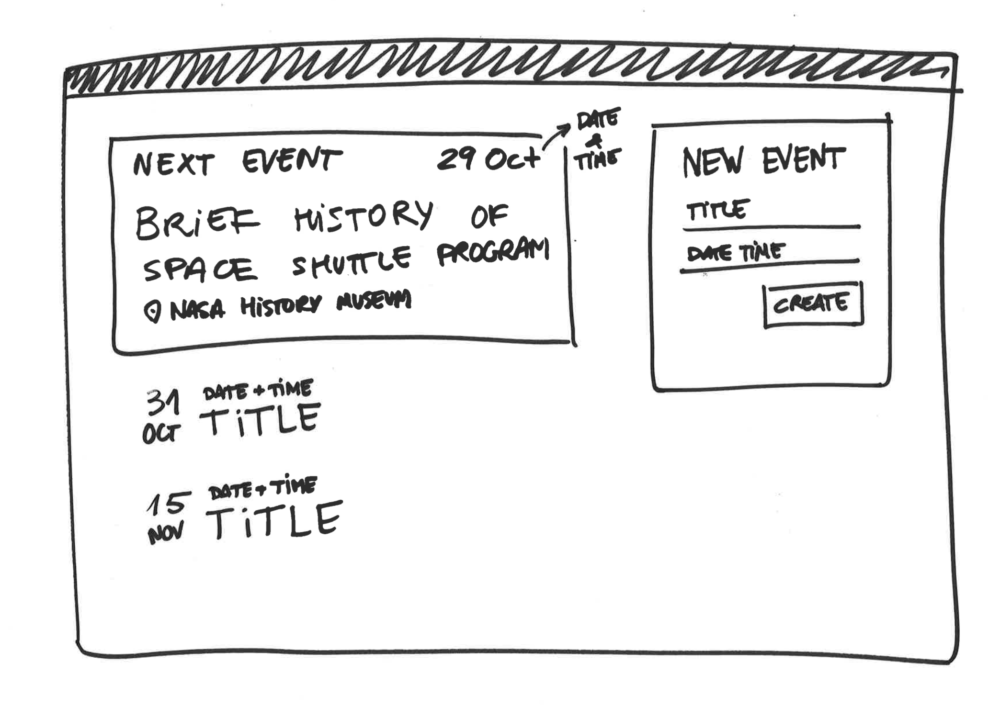

# Juniors Assessment (4 hours)

## Exercise

In this final assessment, you have to create a full-stack app that lets users create events. There is no restriction to complete this task.

1. Fork this repo and clone the forked one.
2. Work and commit often following the [Semantic Comit Message](https://seesparkbox.com/foundry/semantic_commit_messages) convention.
3. Push your changes and create a pull request into the original Codeworks repo.

### Back-End

For this part, you will have to work on the folder `./server`. In there you will have to create a [Koa](http://koajs.com/) server that  should be connected to a MongoDB database with [mongoose](http://mongoosejs.com/) and should serve a RESTful API. Specifically, it should respond to the following methods:

- `POST /events`

  This method should create a record on the database by accepting the following params:

  - `title`: *String*. A descriptive title for the event.
  - `date`: *DateTime (ISO 8601).* Date and Time of the event.
  - `venue`: *String*. Where the event is taking place.

  All of these methods are mandatory. In case of missing some it should return a `400 Bad Request`.

  The request should return the correct HTTP Status code in case of success.

- `GET /events`

  It must respond the list of events that are stored in the database in JSON format. 

  ```json
  [
    {
      "id": "…",
      "title": "Brief history of Space Shuttle program",
      "date": "2016-10-29 19:00:00+01:00",
      "venue": "NASA History Museum"
    },
    {
      "id": "…",
      "title": "Why did the Challenger explode?",
      "date": "2016-11-31 18:30:00+01:00",
      "venue": "Albert II Library Building"
    }
  ]
  ```

### Front-End

For this part, work on the `./client` folder. Create a client that consumes the API published on the back-end section. It has to be done on `React` + `Redux`. For this, we encourage you to use [create-react-app](https://github.com/facebookincubator/create-react-app) and then adding Redux to it.

Please, put all the *Presentational Components* in the `components` folder and the *Container Components* in the `containers` folder.

Specifically you have to create an app that allow to the user do the following:

- View a list of the following events

- Add a new event

  When a new event is added, the event list should reflect the changes automatically and the form fields should be cleaned.




## Extra credit

### Client side

- Add a loader (spinner, circular progress…) to the event list that is shown only when fetching/
- Show an error when the new event request throws an error.

